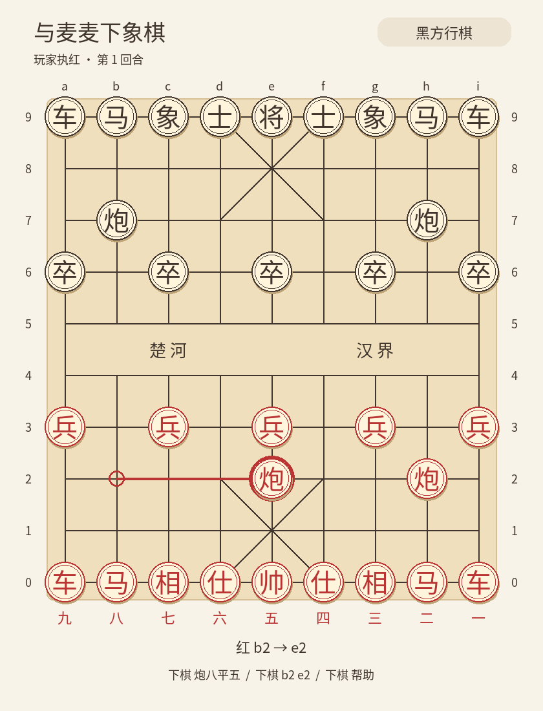

# MaiBot LLM 中国象棋

[](https://github.com/sky2002/maibot-xiangqi-plugin/actions/workflows/test.yml)

让群友用「炮八平五」、坐标或自然语言，与 MaiBot 的 LLM 下中国象棋。
默认由 **Fairy-Stockfish 引擎给候选，LLM 最终拍板、自动解说和聊天**。[pyffish 0.0.90](https://pypi.org/project/pyffish/0.0.90/) 检查合法着法和胜负；模型失败时不会随机落子或自动代选。



## 安装到 Linux

适配 **MaiBot 1.2.5 系列的新插件运行时、maibot-plugin-sdk 2.8.1、Python 3.12+**。旧版 `BasePlugin` 插件系统不兼容。插件 ID 为 `sky2002.xiangqi`。

先停下 MaiBot，在 **MaiBot 根目录**执行：

```bash
git clone https://github.com/sky2002/maibot-xiangqi-plugin.git plugins/maibot-xiangqi-plugin
uv pip install --python .venv/bin/python -r plugins/maibot-xiangqi-plugin/requirements.txt
```

使用 pip 管理环境时，第二行可换为：

```bash
.venv/bin/python -m pip install -r plugins/maibot-xiangqi-plugin/requirements.txt
```

依赖必须安装在 **MaiBot 实际运行的 Python 环境**；环境路径不是 `.venv` 时请替换。不要安装到插件自己的虚拟环境后，仍用另一个环境启动宿主。

安装官方引擎，然后通过隔离启动器启动（仍在 MaiBot 根目录）：

```bash
.venv/bin/python plugins/maibot-xiangqi-plugin/scripts/install_engine.py
.venv/bin/python plugins/maibot-xiangqi-plugin/scripts/run_isolated.py -- .venv/bin/python bot.py
```

原来使用 uv 启动时，最后一行可替换为：

```bash
.venv/bin/python plugins/maibot-xiangqi-plugin/scripts/run_isolated.py -- uv run --no-sync bot.py
```

如果出现 `FileNotFoundError: ... /snap/bin/uv`，说明启动器未能执行 uv。这个路径可能只是 PATH 搜索的最后一项，不一定表示安装了 Snap 版 uv。只要现有 `.venv` 已装好宿主及插件依赖，就使用上面的 `.venv/bin/python ... -- .venv/bin/python bot.py` 命令，无需安装 uv，也不会失去 CPU 隔离。0.2.1 起会提前检查启动命令，并在无法启动时给出明确提示。

`--` 后面是原来的启动命令和参数；若入口不是 `bot.py`，替换为实际入口。`--no-sync` 避免 uv 清理额外安装的插件依赖。**不要同时保留原来未隔离的 MaiBot 进程。** 安装与启动使用同一 Linux 用户，不需要 sudo。安装器只支持 Linux x86_64，从官方发布下载约 2.5 MB 的固定引擎并核验 SHA256，默认放在 `~/.local/share/maibot-xiangqi/`（遵循 `XDG_DATA_HOME`）。

在插件管理页确认「LLM 中国象棋」已加载并启用，授予其声明的 `send.text`、`send.image`、`llm.generate`、`config.get` 能力。SDK 会生成插件 `config.toml`，默认启用。宿主 `utils` 任务需要已有可用模型。

群内发送：

```text
下棋 开始
下棋 炮八平五
```

初次启动先发开局图；玩家合法落子后提示思考中，bot 走完后发新棋盘，自动给出使用宿主人设和引擎依据生成的解说。棋手直接说「这步为什么这么走」「你这步有点厉害」即可聊本局，**不需要聊天指令**；普通聊天不会改变棋盘。

### i7-7700 的 CPU 隔离

默认 `Threads=1`、64 MB 哈希表、每步搜索上限 800ms、最多 3 个候选；低难度达到深度上限会提前结束。多个群共用串行搜索，不会一群开一个搜索同时抢占 CPU；等待 LLM 时没有后台引擎搜索。64 MB 是哈希表大小，进程总内存会更高。

启动器读取 Linux 的 `thread_siblings_list` 和允许使用的 CPU 集合，为引擎预留一个**完整物理核心**，引擎只使用其中一个逻辑 CPU，MaiBot、uv 和插件 runner 继承其余核心的亲和性。正常启用全部核心的 i7-7700 上相当于 MaiBot 使用 3 个物理核心、引擎使用 1 个；不假定逻辑 CPU 编号连续。

只查看分配、不启动：

```bash
.venv/bin/python plugins/maibot-xiangqi-plugin/scripts/run_isolated.py --dry-run
```

可在 `--` 前加 `--engine-cpu 3` 手动选逻辑 CPU；脚本仍会排除该核心的所有超线程。插件每次搜索前核验 runner 到启动器父链的各线程亲和性，再通过 `taskset` 启动引擎。缺少引擎、缺少 `taskset`（安装 `util-linux`）、核心不足或隔离未生效时明确报错并保留棋局。若存在容器/cgroup CPU 限制，必须允许访问预留核心。

这保证经启动器运行、且未被其他组件改写亲和性的 MaiBot 与引擎不共享物理核心；其他系统进程仍可能使用该核心。引擎候选来自短时搜索，不保证必胜，也不作为正式裁判。

### CPU、依赖和字体

- Linux x86_64 可使用 pyffish 发布的 manylinux wheel（需要 glibc 2.27+）。仓库 CI 在 Ubuntu 上验证 Python 3.12、3.13。
- ARM64 或其他没有匹配 wheel 的系统需要从源码编译 pyffish。Debian/Ubuntu 可先安装 `build-essential` 和匹配当前 Python 版本的开发头文件，再运行依赖安装命令；该平台尚未单独验证。
- 内置约 190 KB 的 Noto 中文字体子集，Pillow 直接生成 PNG。无需浏览器、外部画图服务或系统中文字体。
- 如果启动脚本会执行严格的 `uv sync`，可能清理额外安装的插件依赖。请使用宿主提供的插件依赖管理，或在同步后重新执行上面的插件依赖安装命令。

## 指令

所有指令都需要 `下棋` 加空格，群聊中的普通讨论不会触发落子。

| 指令 | 行为 |
| --- | --- |
| `下棋 开始` / `下棋 开始 红` | 发起者执红先走 |
| `下棋 开始 黑` | 发起者执黑，bot 执红先走 |
| `下棋 开始 黑 简单` / `下棋 开始 红 2` | 开局选择难度，颜色可省略 |
| `下棋 难度` | 查看本局难度；没有棋局时查看新局默认值 |
| `下棋 难度 简单` / `下棋 难度 2` | 发起者调整本局难度，从下一次搜索生效 |
| `下棋 炮八平五` | 中文棋谱；数字和常见繁体字也支持 |
| `下棋 前车平八` | 支持前/后/中棋子；仍有歧义时列候选 |
| `下棋 b2 e2` / `下棋 b2e2` | 固定棋盘坐标 |
| `下棋 把b2的炮移到e2` | LLM 解析明确意图，程序校验 |
| `下棋 选择 1` | 由发起者确认本局候选列表中的走法 |
| `下棋 棋盘` | 任何群友可查看当前棋盘 |
| `下棋 悔棋` | 撤回最近一次玩家落子及 bot 回应 |
| `下棋 重试` | bot 失败或重启后轮到 bot 时，重新请求选招 |
| `下棋 认输` | 发起者认输，bot 获胜 |
| `下棋 结束` | 配置的本群管理员结束，不计胜负 |
| `下棋 帮助` | 查看使用说明 |

棋盘始终红方在下，`a0` 在左下，`i9` 在右上。棋谱的路数按执棋方视角计数：红方从右到左一至九，黑方从黑方自己的右到左 1 至 9。执黑时也不翻转图片，坐标不会变化。

每群同时一盘，绑定发起者账号。围观者只能查看棋盘，不能落子、悔棋、确认候选或重试。查看棋盘和无效指令不延长占桌时间。思考或解析期间拒绝新的落子和悔棋，仍允许发起者认输、管理员结束。

自然语言只用于解析本条落子意图，不能替玩家推荐或选择好棋。语义含糊时会列出候选或要求补充；LLM 的语义判断仍可能有误，精确操作建议使用棋谱或坐标。

## 难度与棋力

当前引擎为 Fairy-Stockfish 14 largeboard 的传统评估版，关闭 NNUE，单线程短时搜索后再让 LLM 选招。没有做真人对局评级，**不能把它标成某个天天象棋段位、职业等级或准确 Elo**。[官方对 14.0.1 XQ 的介绍](https://fairy-stockfish.github.io/release/2021/11/19/fairy-stockfish-14-0-1.html) 中的超人类棋力指向 NNUE 版本，不是本插件的当前配置。

[官方棋力说明](https://github.com/fairy-stockfish/Fairy-Stockfish/wiki/Playing-strength#xiangqi) 将传统评估版的象棋能力描述为至少 master level，略高于象眼及 Cyclone 0.55。这是对引擎的概括，不能视为本插件在 800ms 搜索及 LLM 选招条件下的真人等级认证。

| 档位 | 名称 | 搜索深度上限 |
| --- | --- | --- |
| 1 | 入门 | 1 |
| 2 | 简单 | 3 |
| 3 | 标准（新局默认） | 6 |
| 4 | 困难 | 10 |
| 5 | 挑战（升级前的搜索方式） | 不额外限制深度 |

五档是相对搜索强度，不是经标定的人类水平。更高档允许搜索更深，但具体局面、机器速度、时间预算和 LLM 的选择都会影响实际表现，不保证每一步都比低档好，也不保证入门档适合所有初学者。深度指引擎的搜索迭代深度，不能直接理解为完整算清这么多回合。所有档位仍受 `engine.movetime_ms` 上限约束，不会突破单核隔离或增加搜索线程。

在群里直接使用：

```text
下棋 开始 简单
下棋 难度
下棋 难度 4
```

只有棋局发起者可以调整，思考或解析走法时需等待。难度只影响下一次引擎搜索，不改棋谱、不触发落子、不延长占桌时限；普通聊天不能修改难度。设定随棋局保存，重启后保留，不影响其他群。新开局采用配置默认值或开局指令指定值；旧存档缺少难度字段时按挑战档继续，保持升级前的行为。纯 LLM 模式不提供引擎难度调节。

实现采用 `go depth` 配合原来的时间上限，让提供给 LLM 的候选本身来自不同深度的搜索。[引擎源码中的 Skill Level](https://github.com/fairy-stockfish/Fairy-Stockfish/blob/fairy_sf_14/src/search.cpp) 会在搜索结束后将次优着法换成最终推荐；我们从 MultiPV 交给 LLM 选招，所以不依靠这个最终推荐的降强机制，也不展示未经象棋标定的 UCI_Elo。

## 配置

可在插件配置页编辑，或参考 [config.example.toml](config.example.toml)。不要覆盖已有配置。修改配置后重载插件或重启宿主。

| 字段（`[chess]`） | 默认 | 含义 |
| --- | --- | --- |
| `model_name` | `""` | 选招模型；填宿主已配置的具体模型名称，留空使用 `utils` |
| `request_timeout` | `30` | 每次自然语言解析请求最多等待的秒数，1–300 |
| `move_timeout` | `120` | 每次 bot 选招最多等待的秒数，1–300；独立于解析限时 |
| `idle_minutes` | `30` | 无有效操作的占桌时限，1–10080 分钟 |
| `repetition` | `3` | 同一局面且同一方行棋出现几次后和棋，2–10 |
| `no_capture_halfmoves` | `120` | 连续无吃子半回合数，2–1000 |
| `commentary` | `true` | 是否生成简短人设棋评 |
| `auto_chat` | `true` | 对局期间自动回应棋手的相关聊天，无需指令 |
| `chat_cooldown` | `15` | 同群自动聊天请求间隔秒数 |
| `admins` | `[]` | 管理员名单：`["平台:群号:用户号"]` |

自然语言解析、棋评和聊天复用 `utils`；`model_name` 只覆盖 bot 选招。请求沿用宿主的 token 与温度设置。选招和解析在超时、接口失败或无效输出后自动重试一次；最坏可能等两次超时时长，随后保留棋局。棋评单独限时 10 秒、聊天生成限时 8 秒，失败不会影响落子。引擎不能解决模型接口超时或鉴权错误，但把选招范围缩小到少量有分析依据的候选。

| 字段（`[engine]`） | 默认 | 含义 |
| --- | --- | --- |
| `enabled` | `true` | 混合模式；明确设为 `false` 才使用旧纯 LLM 模式 |
| `difficulty` | `3` | 新局默认难度 1–5；已有棋局保持已保存的难度 |
| `executable` | `""` | 留空用安装器路径；可指定绝对路径的兼容 Fairy-Stockfish largeboard |
| `candidates` | `3` | 交给 LLM 的候选数，1–5，合法走法不足时减少 |
| `movetime_ms` | `800` | 搜索毫秒数，100–3000；不包含排队、进程启动与 LLM 请求 |
| `hash_mb` | `64` | 哈希表大小，16–256 MB |

自动聊天只处理当前对局发起者的最多 300 字文本，读取本条消息、当前棋盘、适用的上次引擎分析及人设，不读取整个群历史。聊天内容不进入选招请求；仅成功发送相关回复后拦截宿主普通回复，避免重复回答。无关话题、围观者、冷却期间和聊天失败时继续宿主普通处理。下棋指令始终保留命令前缀；聊天不能直接悔棋、认输或结束。棋局发生变化后丢弃尚未发送的旧棋评。

### 模型反复选招失败时

0.1.0 会把超时、接口错误、空响应和不符合格式的回答都显示成「模型两次未能返回有效走法」，无法凭这句话判断原因。**0.1.1 起会分别显示两次失败的具体类别**，并兼容说明文字/Markdown 包裹的单个 JSON 答案和字符串形式的数字编号。多个候选、重复字段、非法编号和未完成的思考内容仍会被拒绝。

升级后，已有的 `request_timeout = 30` 继续控制自然语言解析；新增的 `move_timeout` 缺省为 120 秒，给 bot 选招更多时间。可在 `[chess]` 中明确设置：

```toml
move_timeout = 120
```

若宿主模型任务或 API 提供方的超时更短，它们仍可能提前结束请求；插件不会自动改动宿主配置。思考型模型还需要足够的输出 token 预算，例如 [DeepSeek 的思考模式](https://api-docs.deepseek.com/guides/thinking_mode/)。插件不会把 `reasoning` 字段当作最终落子。

| 新提示/日志类别 | 排查方向 |
| --- | --- |
| 请求超时 / `timeout` | 检查 `move_timeout`、宿主任务及提供方超时；较慢模型可尝试 180 秒 |
| 接口鉴权失败 / `auth_error` | 检查宿主模型的认证配置 |
| 接口限流 / `rate_limit` | 等待限流解除，检查模型服务用量 |
| 只有思考、没有最终答案 / `reasoning_only` | 检查输出 token 预算和模型思考配置；日志本身不能证明一定是 token 截断 |
| 空内容 / `empty_response` | 检查宿主的响应解析及模型服务日志 |
| 格式或编号错误 / `invalid_format`、`invalid_id` | 模型未给出唯一合法编号，第二次请求会附带具体格式要求 |

宿主日志可搜索 `[xiangqi.llm]`，其中记录阶段、尝试次数、错误类别、耗时、正文长度及是否有思考字段。不记录模型正文、推理内容、群聊或服务端错误原文，避免这些内容进入插件诊断日志。

**管理员权限说明：** 当前 SDK 的群消息字段没有可信的群主/管理员角色。因此需要 bot 部署者将允许强制结束的群管理员写进名单，插件不根据发言内容或自称管理员授予权限。例如 QQ 群 `123456` 的管理员 `987654` 写为 `qq:123456:987654`。同一账号在别的群不会因此获得权限。

## 裁判规则与棋力

- 马腿、象眼、炮架、九宫、过河兵、将帅照面、自陷被将军等由 pyffish 检查。
- 将死和困毙均判无合法走法的一方负，优先于和棋规则。
- **插件自定义简化和棋规则**：棋子位置与行棋方相同的局面第 3 次出现，或连续 120 个半回合没有吃子，自动和棋。双方各走一步算两个半回合；兵移动也计入无吃子计数。阈值可配置。
- 长将、长捉不单独判责，可能通过反复将军达到重复和棋；首版不是赛事级裁判。
- 规则阈值和空闲时限在开局时保存，改配置后对新局生效。
- 混合模式下 LLM 从引擎候选中选招，依然可能选择较差候选；关闭引擎时从全部合法走法中选。

## 存档与故障恢复

棋谱保存在 SDK 分配的 `self.ctx.paths.data_dir/xiangqi.sqlite3`，通常为宿主 `data/plugins/sky2002.xiangqi/`。按群保留当前或最近结束的一盘；新局替换上一盘。只存储必要的群/玩家标识、棋谱及时间，不保存普通群聊或模型推理文本。

每一步先检查再原子保存，之后才发图或请求 bot。模型失败不会丢掉玩家已经走出的一步。重复投递的消息不会再次执行；认输、结束、超时或开新局后到达的旧模型回复会被丢弃。

重启后发送 `下棋 棋盘` 查看：轮到玩家时可直接走，轮到 bot 时发送 `下棋 重试`。歧义候选列表不持久化，重启后重新描述即可。停机时间计入空闲时限，超过时限的棋局启动时直接结束。结束的棋局不能悔棋，可查看末局棋盘或开新局。

## 更新

停下 MaiBot 后，在根目录执行：

```bash
git -C plugins/maibot-xiangqi-plugin pull --ff-only
uv pip install --python .venv/bin/python -r plugins/maibot-xiangqi-plugin/requirements.txt
```

从 0.1.x 升级到 0.2.0 后默认启用引擎：还需执行上面的 `install_engine.py`，并通过 `run_isolated.py` 重启。若暂时沿用旧模式，明确设置 `[engine] enabled = false`。插件运行数据位于 SDK 的数据目录，更新源码不会覆盖存档。

从 0.2.x 升级到 0.3.0 不需要重新安装引擎或额外依赖，拉取代码后按原隔离命令重启即可。新局默认标准档，旧棋局按挑战档继续；可用「下棋 难度」查看或调整。

## 开发验证

在插件目录运行：

```bash
uv sync --group dev
uv run pytest -q
uv run ruff check .
```

测试使用真实 pyffish 和 Pillow，LLM/群消息接口使用可控替身；包括走法、裁判、权限、重复消息、重试、悔棋、群隔离、候选约束、自动聊天、迟到回复、SDK 入口和中文 PNG。Linux CI 另外安装真实引擎，经隔离启动器验证子进程与宿主亲和性及红黑候选搜索。真实聊天平台和模型服务需要安装后联调。

## 开源组件

- [pyffish / Fairy-Stockfish](https://github.com/fairy-stockfish/Fairy-Stockfish)：规则绑定，GPL-3.0-or-later；使用的 [0.0.90 源码发布](https://pypi.org/project/pyffish/0.0.90/#files)。
- [Fairy-Stockfish 14 largeboard](https://github.com/fairy-stockfish/Fairy-Stockfish/releases/tag/fairy_sf_14)：独立 UCI 引擎，单线程、关闭 NNUE；安装器直连官方二进制，[对应源码](https://github.com/fairy-stockfish/Fairy-Stockfish/tree/fairy_sf_14)。
- [Pillow](https://github.com/python-pillow/Pillow)：棋盘绘制，HPND。
- [maibot-plugin-sdk](https://github.com/Mai-with-u/maibot-plugin-sdk)：插件协议和宿主能力调用。
- [Noto CJK](https://github.com/notofonts/noto-cjk)：中文字体，SIL OFL 1.1；子集更名为 MaiBotXiangqi，见 [字体说明](xiangqi/assets/README.md)。

插件代码采用 [GPL-3.0-or-later](LICENSE)。
