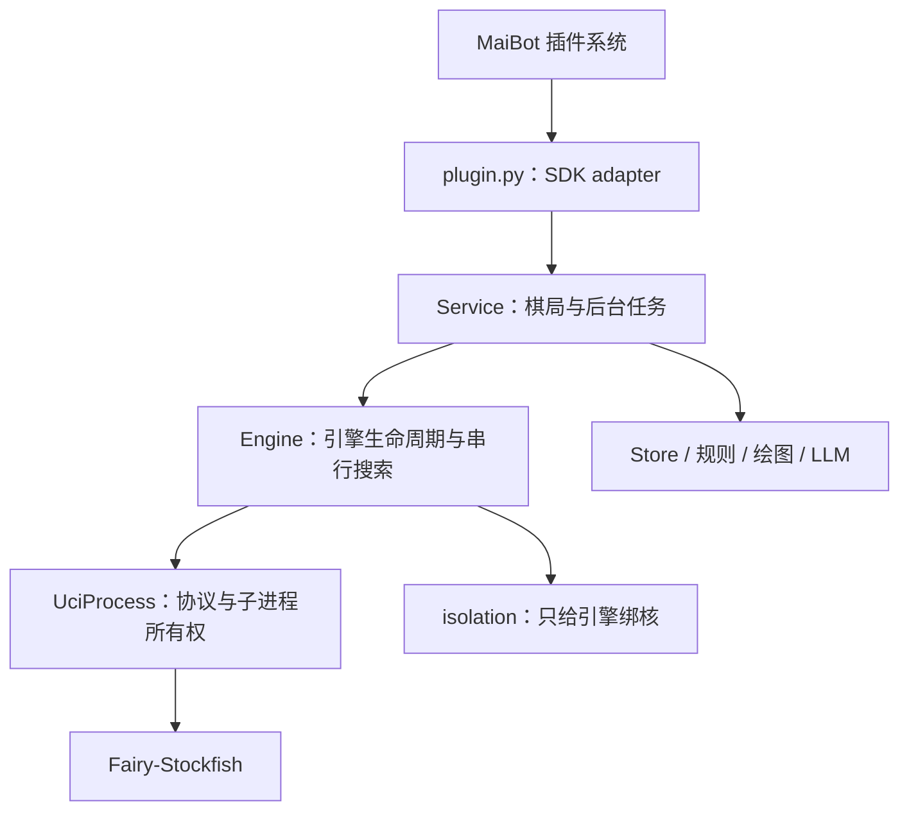

# 象棋插件运行架构

所有实现都在插件独立仓库内，通过 SDK 接入生命周期，不导入或修改 MaiBot 主程序。

## 所有权与调用顺序

- `plugin.py` 是 SDK adapter，只负责交接加载、配置更新、卸载与消息。
- `Service` 持有棋局存储和后台任务；启动验证存档、准备引擎并开启过期清理；关闭先取消任务，再回收引擎，最后关闭数据库。
- `Engine` 提供 `start(settings)`、`analyse(board, settings)`、`close()` interface。CPU 选择、进程复用、跨群排队、配置切换及错误清理集中于这一 module，调用者不需要知道启动顺序或环境变量。
- `UciProcess` 是内部协议 seam，管理握手、管道读取和进程回收；真实引擎与测试中的 Python UCI 程序是两个进程 adapter。业务代码和测试都通过 Engine 或 SDK 生命周期 interface 验证行为。

进程随插件加载启动，空闲时只等待输入，不进行搜索。每次搜索发送 `ucinewgame` 并等待 `readyok`，重置前一次棋局状态；引擎始终关闭 Ponder，保持一个搜索线程。六档难度通过每次搜索的 Skill Level 设置。最终 bestmove 校验后直接保存；LLM 不参与决策，棋评异步运行。

## 失败与配置更新

宿主在 `on_load` 失败后不保证调用 `on_unload`，因此入口必须主动关闭已创建的资源，成功后才公开运行中的 Service。重复加载不重复创建；卸载清空入口引用，重新加载创建新的运行实例。

更换引擎路径或 CPU 时，先验证并握手新进程，再替换旧进程；失败保留旧的运行配置并向宿主抛出错误。保存到 SDK 的新配置可能仍存在，管理员应修正配置后再重载。关闭引擎回收进程；关闭引擎后暂停自动落子，仍可管理保存的棋局；不存在纯 LLM 选招分支。

搜索失败、超时或取消时，丢弃协议流并 kill/reap 对应进程，不自动落子。下一次重试重建进程。插件卸载先取消正在搜索及排队的棋局任务，再关闭引擎，避免子进程残留。

## CPU 约束的选择

0.4.0 取消独立启动脚本。0.4.1 起只在新建的 Python 引擎子进程中通过 `os.sched_setaffinity` 设置单个逻辑 CPU，随后 exec 引擎；不依赖 taskset；不会修改宿主、祖先进程或共享 runner 的亲和性。默认从 runner 允许的 CPU 集合选择最大编号，可用 `engine.cpu` 指定。

这提供单线程、固定 CPU 和搜索时间限制，不承诺独占物理核心。保留旧的整核排他保证需要在宿主创建所有线程前调整部署方式，不能由已经加载的插件安全实现。用户选择保持 MaiBot 原调度，因此不再读取旧启动器环境变量或核验祖先进程。

## 验证

生命周期测试使用真实 Python 子进程和实际管道，覆盖自动加载、重复加载、重载、配置启停和失败、搜索取消、超时、崩溃、卸载与数据库清理。Linux CI 直接运行测试，不套启动脚本；从全新数据目录自动准备内置引擎，另验证真实引擎搜索、子进程绑核及宿主亲和性不变。

这种收拢增加 module 的 depth：进程管理的 locality 集中于引擎内部，SDK 入口与多群搜索共享同一套清理逻辑，获得 leverage。删除 Engine 会把顺序、互斥和清理约束重新散布给调用者，因此它通过 deletion test。

宿主接入约定参考 [MaiBot SDK 开发指南](https://github.com/Mai-with-u/maibot-plugin-sdk/blob/main/docs/guide.md)，实际行为以当前宿主运行时及本插件测试为准。

## WebUI 安装与离线资源

宿主根据 manifest 自动安装 Python 依赖并发现插件。引擎二进制作为普通 Git 文件随仓库分发，不依赖 Git LFS、外部安装命令或加载期间联网下载，因此不会因下载耗时阻塞宿主启动。对应源码归档与许可证位于同一 assets 目录。

`bundled_engine` 负责固定版本、SHA256、缓存权限与原子写入；默认缓存位于 SDK 数据目录。`Engine` 在线程中完成文件准备，避免阻塞 runner 的事件循环。内置资源校验失败直接报错，不执行不完整文件；显式自定义引擎路径跳过内置资源准备。子进程以当前 Python 启动 `engine_worker.py`，绑核后用 exec 保持 PID 和管道，原有取消与退出清理逻辑继续覆盖实际引擎。

## 原生难度与语言功能

Engine 的 analyse 返回一个 EngineMove，其走法必须来自本次 bestmove 并通过规则库校验。分析分数与 PV 只在确实对应所走着法时附带，信息缺失不会阻止合法落子，也不会用其他着法的分析替代。六档 Skill Level 为 -20、-12、-4、4、12、20；这是初始映射，并非经过真人或大量对弈标定的等级。

Service 获取引擎结果后重新检查棋局快照，落盘、发棋盘，再启动异步棋评。LLM 只读取解析用户本条指令所需的合法着法，或者已完成落子的解说信息。Player 不再提供 select 方法，旧 model_name、move_timeout、candidates 配置由 SDK 忽略，不添加宿主迁移钩子。
